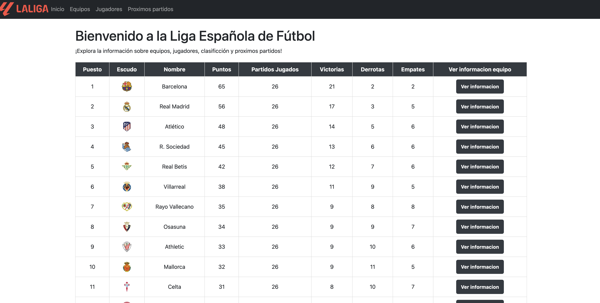
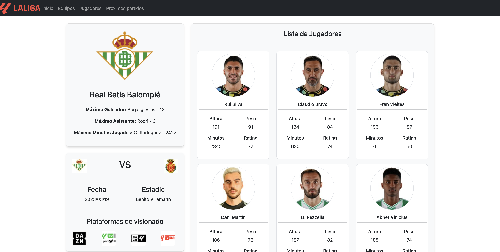

  <h1 style = "red"> 🔴 disclaimer | LEE ATENTAMENTE 🔴</h1> 
  
•Es un proyecto para practicar, las apis con las que se trabajan estan incompletas de datos, esto significa que el unico equipo del que puedes ver mas informacion es el BETIS. Las apis se encuentran en un server externo, en cualquier momento pueden dejar de existir/funcionar.  
  •El codigo esta realizado de manera para que funcione para cualquier equipo, la relacion utilizada para los jugadores, proximos partidos y los datos del equipo es a traves del ID.  
  •No es 100% responsive, el objetivo es a nivel de codigo no de diseño. Se aceptan consejos para seguir mejorando 👍🏻.
  

⚔️ Proyecto personal para practicar el consumo de apis con fetch y el uso de async y await. Diseño boostrap & css ⚔️
 
🌐 --> https://futbolfs.vercel.app/
<h2>Index</h2>

<h2>Equipo seleccionado</h2>

